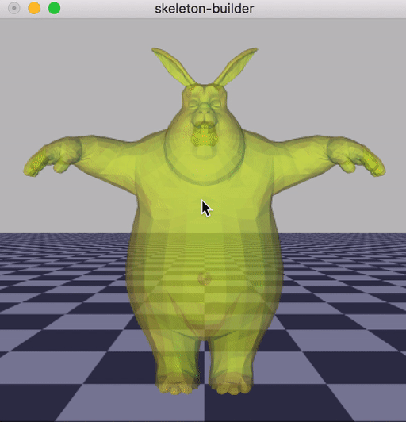

# skeleton builder

> **Get started with:**
>
>     git clone --recursive http://github.com/alecjacobson/skeleton-builder

This small application loads in a 3D model as a mesh and launches an then an
interactive OpenGL window where the user can draw a [linear blend
skinning](http://skinning.org) skeleton inside of the model. When finished, the
the skeleton can be saved as a [.tgf
file](http://libigl.github.io/libigl/file-formats/tgf/). 

## Compilation

    mkdir build
    cd build
    cmake ../
    make

## Execution 

    ./skeleton_builder mesh.obj

For example if you issue:

    ./skeleton_builder ../big-buck-bunny.obj

You could make a skeleton like this:

## See also

 - [skeleton poser](http://github.com/alecjacobson/skeleton-poser)
